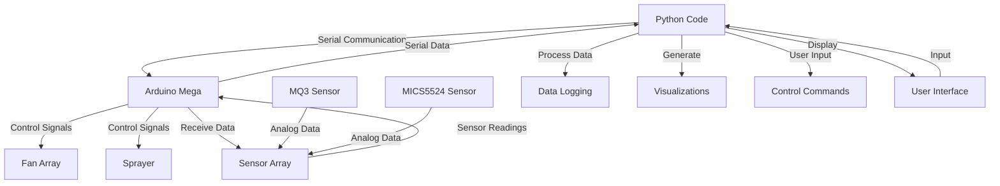

# How to run the sensor data script
 - First make sure the new sensor code(CommunicationRX_DSK) is flashed to the arduino
 - Next load the python script(in Sensor data processing) as well as its packages
 - In the script change the serial port to be that of the arduino on line 9
 - When ran the script gathers 60 seconds of data change that on line 11 if you want it to run for more or less
 - Open the markdown file in Obsidian after the script is done running
 

