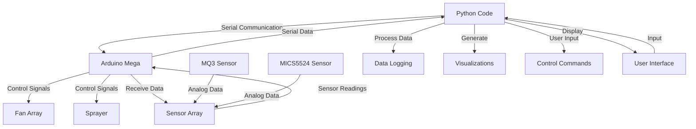

# How to run Serial tests
First launch both the gui and whatever test you would like to run
Second set up some form of virtual serial connection(I used [Virtual  Serial port](https://www.virtual-serial-port.org/))
## Fans and sprayer
Connect the tester program to COM2
Connect the fans controller in the gui to COM1
Connect the Sensor controller to Something random
Either Change fan settings or run Sprayer program
The logs will reflect either running
## Sensors
Connect the tester program to COM1
Connect The sensor controller in the gui to COM2
Generate Test data in the tester program
Send Test data in the tester program
The graphs in the GUI will reflect the data sending properly

